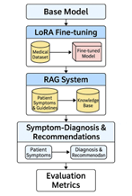

# MedDiag-LoRA-RAG

A Medical Symptom Diagnosis and Recommendation Generation System Based on LoRA Fine-Tuning and RAG Mechanism

## Overview

This project presents a hybrid clinical decision support system that leverages **LoRA fine-tuning** and **Retrieval-Augmented Generation (RAG)** to enhance the diagnostic and recommendation capabilities of large language models (LLMs). By integrating LLaMA-2/3 models with a structured medical knowledge base, the system delivers accurate, interpretable, and domain-adapted responses to free-text patient symptom descriptions.

## Key Features

- **Symptom-to-Diagnosis Generation** using fine-tuned LLaMA-2-7B and LLaMA-3-8B models
- **LoRA** for lightweight parameter-efficient domain adaptation
- **RAG** for retrieving relevant medical knowledge from the NHS Conditions API
- Evaluation using BLEU, ROUGE, METEOR, and fuzzy matching accuracy
- Instruction-style data with 5,000+ symptom-diagnosis-recommendation pairs

## System Architecture

1. **Instruction-Tuned Model**: LLaMA models are fine-tuned using a custom Alpaca-style dataset containing natural language medical instructions.
2. **RAG Mechanism**: A FAISS-indexed medical knowledge base is used to retrieve disease-specific content and prepend it to model prompts.
3. **Generation Pipeline**: The combined input is processed to generate diagnosis and treatment recommendations.

  

## Dataset

- Training data derived from:
  - Symptom-Disease mappings (based on GitHub: [Symptom Based Disease Prediction Chatbot])
  - Augmented symptom combinations (984+)
- Knowledge base built from:
  - NHS Health A to Z
  - OpenEvidence AI Medical Assistant

## Model Configuration

| Model Variant              | METEOR | BLEU | ROUGE-1/L | Fuzzy Accuracy |
|---------------------------|--------|------|-----------|----------------|
| LLaMA2 (7B)               | 0.04   | 0.05 | 0.06/0.06 | 11.18%         |
| LLaMA2 + LoRA             | 0.31   | 0.40 | 0.42/0.42 | 46.14%         |
| LLaMA2 + LoRA + RAG       | 0.34   | 0.42 | 0.44/0.44 | 48.96%         |
| LLaMA3 (8B)               | 0.12   | 0.17 | 0.19/0.19 | 29.88%         |
| LLaMA3 + LoRA             | 0.64   | 0.89 | 0.90/0.90 | 91.36%         |
| **LLaMA3 + LoRA + RAG**   | **0.65** | **0.91** | **0.92/0.92** | **95.83%**     |

## Training Details

- **LoRA Config**: `r=8`, `alpha=32`, modules: `q_proj`, `v_proj`
- **Optimizer**: AdamW (lr = 2e-4, batch size = 2, gradient accumulation = 4)
- **Hardware**: Single NVIDIA A100 (80GB)
- **Embedding Model**: `sentence-transformers/all-mpnet-base-v2`

## Evaluation Metrics

- **BLEU**: Measures n-gram precision
- **ROUGE-1 / ROUGE-L**: Measures recall and structure
- **METEOR**: Captures semantic similarity and paraphrase
- **Fuzzy Matching Accuracy**: Based on Levenshtein similarity

## Limitations

- Currently supports only **single-turn** queries
- Lacks patient-specific contextual information (e.g., age, labs)
- Limited coverage (60 diseases in RAG, 40 in training set)
- Not yet deployed or validated in real clinical settings

## Future Work

- Enable multi-turn medical conversations
- Incorporate patient history and lab results
- Expand disease knowledge base
- Conduct clinical user testing and deployment